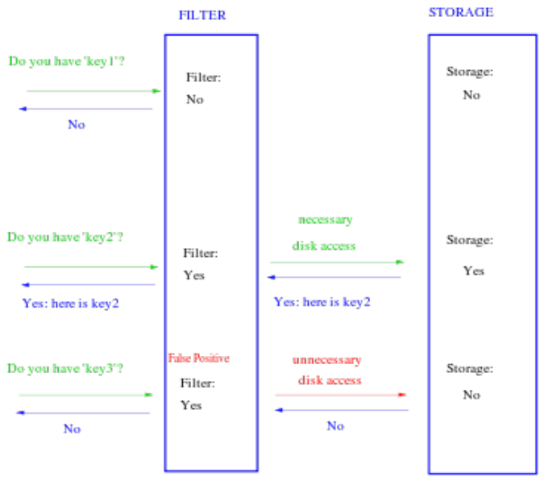

# Tarea 3

El objetivo principal de esta tarea es implementar correctamente un Filtro de Bloom. Este es un filtro que sirve cuando queremos buscar elementos en una base de datos grande y queremos evitar recorrer toda la base (o parte de ella). Para esto, aplicamos este filtro el cual nos dirá si el elemento que buscamos está en la base de datos o no. Es un algoritmo probabilístico “one-side error”: si dice que el elemento no está, efectivamente no está, pero puede equivocarse al decir que el elemento está.
La siguiente figura muestra cómo actúa el filtro.

## 1. Descripción del Filtro de Bloom

El filtro de Bloom usa un arreglo `M` de **m** bits inicializado en `0` y **k** funciones de hash distintas `h1, h2, ..., hk`. Al aplicar `hi(x)` retorna un valor entre `[1, m]`, para cualquier elemento `x`. Cuando se inserta un nuevo elemento a nuestro universo `U`, se aplica cada una de las **k** funciones de hash, lo que devolverá distintas posiciones `j` en el arreglo `M`. Luego modificamos `M[j] = 1`, para cada `j` retornado por cada función de hash.

Luego, cuando buscamos un elemento `y`, aplicamos el filtro de Bloom: calculamos `hi(y)`, con `i \in [1, k]`. Si cada una de las funciones de hash retorna `1`, entonces buscamos el elemento en la base de datos. Si al menos una de las funciones de hash retorna `0`, entonces podemos decir con seguridad que el elemento no se encuentra en la base de datos.

Para esto, usaremos datos desde un archivo CSV (entregado anexo a este documento) que lista los nombres populares de bebés. Aplicaremos el filtro a estos datos:
	1. Creamos un arreglo `M` de **m** bits.
	2. Creamos **k** funciones de hash `h1, h2, ..., hk`.
	3. Para cada elemento `x` del archivo [`Popular-Baby-Names.csv`](Popular-Baby-Names-Final.csv) calculamos `yi = hi(x)` y modificamos el arreglo `M[yi] = 1`.
Con el filtro ya listo, podemos empezar a realizar búsquedas en el CSV con él.

## 2. Búsqueda

Para una secuencia de palabras `N`, realizaremos la búsqueda de cada una de estas de las siguientes
formas:
	- Sin filtro de Bloom: Todas las palabras se buscan en el archivo de manera secuencial mediante un proceso tipo [grep](https://es.wikipedia.org/wiki/Grep).
	- Con filtro de Bloom: Todas las palabras pasan primero por el filtro de Bloom y solo para las que no son descartadas por este se realizará la misma búsqueda señalada en el punto anterior.

## 3. Descripción de la tarea

Para esta tarea, el trabajo será analizar, implementar y evaluar experimentalmente el filtro de Bloom realizando variaciones en sus parámetros. Se deberá entregar un informe que describa la experimentación y resultados de este análisis.

## 4. Relación entre los parámetros del filtro

La [teoría](https://dl.acm.org/doi/pdf/10.1145/362686.362692) señala que existe una relación entre el tamaño del arreglo `M`, el número **k** de funciones de hash a utilizar, y su probabilidad de error. Se tendrán que realizar distintos test para ver si estas relaciones se cumplen. Para esto deberá ir variando los tamaños de `M` y **k**, y comprobar si coinciden con la probabilidad de error esperada.

Respecto a las funciones de hash, deben investigar cómo deben ser estas para poder asegurar un buen comportamiento del filtro de Bloom. Pueden utilizar librerías externas.

## 5. Objetivos

En resumen, para esta tarea se deberá:
1. Investigar la relación entre los parámetros del filtro Bloom, como también las propiedades que deben cumplir las funciones de hash.
2. Implementar el funcionamiento del filtro de Bloom con la base de datos señalada.
3. Realizar testeo para evidenciar que los valores obtenidos se condicen con la teoría, además de comparar sus resultados con una búsqueda sin filtro

## 6. Experimentación

Para una secuencia `N` de nombres, realice las siguientes búsquedas, guardando los tiempos de búsqueda y el porcentaje de error del filtro (cuando corresponda):
	1. Una búsqueda sin el filtro de Bloom.
	2. Las búsquedas con el filtro de Bloom que sean necesarias para poder respaldar las relaciones teóricas.

La idea de la experimentación es que esta pueda respaldar la teoría y mostrar cómo el filtro de Bloom genera mejoras a las búsquedas en distintos contextos. Para obtener lo anterior, se tendrá que realizar las búsquedas (1. y 2.) bajo la siguiente variación de `N`:
	- Variar el tamaño de `N`, utilizando \(|N| \in \{2^{10}, 2^{12}, 2^{14}, 2^{16}\}\)
	- Para cada uno de los valores de \(|N|\) del punto anterior, se debe tener en la lista una cierta proporción de palabras que efectivamente estén en el archivo [`Popular-Baby-Names.csv`](Popular-Baby-Names-Final.csv). Definiendo \(p = \frac{\# \text{palabras del csv en } N}{|N|}\), se debe experimentar con \(p \in \{0, \frac{1}{4}, \frac{1}{2}, \frac{3}{4}, 1\}\). Para esto último, será de utilidad poder usar nombres de películas del archivo [`Film-Names.csv`](Film-Names.csv) para generar las proporciones.

Con esto, se obtendrán 20 combinaciones \((|N|, p)\) con las que realizar las búsquedas (1. y 2.) y obtener los resultados señalados.

## 7. Entregables

Se deberá entregar el código y un informe donde se explique el experimento en estudio. Con esto se obtendrá una nota de código (N_{Cod}) y nota de informe (N_{Inf}). La nota de la tarea será el promedio simple entre ambas notas

### 7.1. Código

La entrega de código debe ser hecha en C++. Tiene que contener:
	- (**0.5 pts**) README: Archivo con las instrucciones para ejecutar el código, debe ser lo suficientemente explicativo para que cualquier persona solo leyendo el README pueda ejecutar la totalidad de su código (incluyendo las librerías que potencialmente se deben instalar).
	- (**0.5 pts**) Experimento: Creación de la lista de nombres a buscar variando lo señalado en este informe.
	- (**2 pts**) Implementación de filtro de bloom.
	- (**2.5 pts**) Obtención de resultados: La forma en el que se obtienen los resultados pedidos es correcta, es decir, se cuentan los tiempos de ejecución adecuados y la probabilidad de error para la búsqueda sin filtro y para las búsquedas con filtro variando los parámetros.
	- (**0.5 pts**) Main: Un archivo o parte del código (función main) que permita ejecutar los distintos métodos de construcción y experimentos.

### 7.2. Informe

El informe debe ser claro y conciso. Se recomienda hacerlo en LaTeX. Debe contener:
	- (**0.8 pts**) Introducción: Presentación del tema en estudio, resumir lo que se dirá en el informe y presentar la hipótesis.
	- (**0.8 pts**) Desarrollo: Presentación de algoritmos, estructuras de datos y cómo funcionan y por qué. Recordar que los métodos ya son conocidos por el equipo docente, lo que importa son sus propias implementaciones.
	- (**2.4 pts**) Resultados: Especificación de los datos que se utilizaron para los experimentos, la cantidad de veces que se realizaron los tests, con qué inputs, que tamaño, etc. Se debe mencionar en que sistema operativo y los tamaños de sus cachés y RAM con los que se ejecutaron los experimentos. Se deben mostrar gráficos/tablas y mencionar solo lo que se puede observar de estos, se deben mostrar los valores y parámetros que se están usando.
	- (**1.2 pts**) Análisis: Comentar y concluir sus resultados. Se hacen las inferencias de sus resultados.
	- (**0.8 pts**) Conclusión: Recapitulación de lo que se hizo, se concluye lo que se puede decir con respecto a sus resultados. También ven si su hipótesis se cumplió o no y analizan la razón. Por último, se menciona qué se podría mejorar en su desarrollo en una versión futura, qué falta en su documento, qué no se ha resuelto y cómo se podrían extender.
Todo lo mencionado debe estar en sus informes en las secciones en las que se señalan, la falta de algún aspecto o la presencia de algún aspecto en una sección equivocada hará que no se tenga la totalidad del puntaje.
